# PSPL Data Engineering Portfolio

A locally runnable data engineering portfolio that mirrors the PSPL's production stack
(Azure Data Factory → Databricks Delta Lake → dbt → Databricks SQL) using open-source
equivalents.

> 📹 **Video Walkthrough**: [Watch on YouTube/Loom](#) *(link to be added)*

---

## Table of Contents

- [Learning resources](#learning-resources)
- [Project Description](#project-description)
- [Architecture Overview](#architecture-overview)
- [Tool Mapping: Local → Cloud](#tool-mapping-local--cloud)
- [Repository Structure](#repository-structure)
- [Prerequisites](#prerequisites)
- [Quick Start](#quick-start)
- [Local scheduling (Apache Airflow)](#local-scheduling-apache-airflow)
- [Run one component (Windows)](#run-one-component-windows)
- [Run one component (macOS / Linux)](#run-one-component-macos--linux)

---

## Learning resources

Use this repository as a structured tutorial, not only as a buildable demo.

| Resource | Purpose |
|----------|---------|
| [docs/README.md](docs/README.md) | **Documentation hub**: onboarding story, document map, pipeline diagram, links to Jupyter and Streamlit |
| [docs/CONCEPTS_AND_PURPOSE.md](docs/CONCEPTS_AND_PURPOSE.md) | **Concepts and why**: medallion layers, Spark vs DuckDB, dbt mental model, local vs cloud narrative |
| [docs/JUPYTER_AND_NOTEBOOKS.md](docs/JUPYTER_AND_NOTEBOOKS.md) | JupyterLab vs nbconvert, `notebooks/00_onboarding_tour.ipynb`, Streamlit dashboard entry |
| [docs/LEARNING_GUIDE.md](docs/LEARNING_GUIDE.md) | Full walkthrough: **Section 5** step-by-step setup/run (Windows, `DELTA_LAKE_PATH`, Spark on Windows), mental model, folder map, learning order, troubleshooting, exercises |
| [docs/RUN_EACH_COMPONENT.md](docs/RUN_EACH_COMPONENT.md) | **Canonical per-component run table:** datagenerator → ingest → notebook → dbt → KPIs → Streamlit → Airflow (Windows `run-component.ps1` vs `make`) |
| [docs/SCOPE_AND_CLOUD.md](docs/SCOPE_AND_CLOUD.md) | **Scope** (in/out) and **local → cloud** alternatives for interviews and migration narratives |
| [docs/training/README.md](docs/training/README.md) | **Trainer pack:** program ([COMPLETE_TECHNICAL_TRAINER_GUIDE.md](docs/training/COMPLETE_TECHNICAL_TRAINER_GUIDE.md)); marketing ([COURSE_MARKETING.md](docs/training/COURSE_MARKETING.md)); slides + notes ([TRAINER_SLIDES_WITH_SPEAKER_NOTES.md](docs/training/TRAINER_SLIDES_WITH_SPEAKER_NOTES.md)); compact outline ([SLIDE_DECK_OUTLINE.md](docs/training/SLIDE_DECK_OUTLINE.md)) |
| [docs/getting-started.html](docs/getting-started.html) | Browser UI with copy buttons for Bash vs PowerShell commands |
| [dashboard/streamlit_app.py](dashboard/streamlit_app.py) | **Streamlit KPI dashboard** over DuckDB marts (run after `dbt run`; use `scripts/run-dashboard.ps1` on Windows) |
| [scripts/run-full-pipeline.ps1](scripts/run-full-pipeline.ps1) | Windows-friendly equivalent of `make all` |
| [scripts/run-dashboard.ps1](scripts/run-dashboard.ps1) | Launches the Streamlit app from `.venv` |
| [scripts/run-sql-kpis.ps1](scripts/run-sql-kpis.ps1) | Windows-friendly equivalent of `make sql-kpis` (needs DuckDB CLI) |
| [scripts/clean-artifacts.ps1](scripts/clean-artifacts.ps1) | Windows-friendly equivalent of `make clean` |
| [scripts/install-airflow.ps1](scripts/install-airflow.ps1) | Installs Apache Airflow 2.10 into `.venv` using official constraints |
| [scripts/airflow-standalone.ps1](scripts/airflow-standalone.ps1) | Local scheduler + web UI (`airflow standalone`, `AIRFLOW_HOME` under `airflow/airflow_home`) |
| [scripts/install-airflow.sh](scripts/install-airflow.sh) / [scripts/airflow-standalone.sh](scripts/airflow-standalone.sh) | Same for Linux/macOS (make `+x` before first run) |
| [docker-compose.airflow.yml](docker-compose.airflow.yml) | Compose stack for local Airflow; on Windows prefer `scripts/run-airflow-docker.ps1` if `docker` is not on PATH |
| [scripts/run-airflow-docker.ps1](scripts/run-airflow-docker.ps1) | Windows: finds `docker.exe` (PATH + Docker Desktop), starts engine if needed, then runs Compose |
| [scripts/run-component.ps1](scripts/run-component.ps1) | Dispatcher: `.\scripts\run-component.ps1 ingest` (names: `datagenerator`, `ingest`, `spark-notebook`, `dbt-run`, `dbt-test`, `dbt-docs`, `sql-kpis`, `dashboard`, `airflow-docker`, `airflow-standalone`) |
| [scripts/run-datagenerator.ps1](scripts/run-datagenerator.ps1) | Synthetic data → `data_large/` only |
| [scripts/run-ingest.ps1](scripts/run-ingest.ps1) | Bronze PySpark ingest only |
| [scripts/run-spark-notebook.ps1](scripts/run-spark-notebook.ps1) | Silver `nbconvert` notebook only |
| [scripts/run-dbt-run.ps1](scripts/run-dbt-run.ps1) / [scripts/run-dbt-test.ps1](scripts/run-dbt-test.ps1) / [scripts/run-dbt-docs.ps1](scripts/run-dbt-docs.ps1) | dbt run / test / docs (docs serve blocks; use another port or stop Airflow if 8080 clashes) |

Open the HTML guide locally: `start docs\getting-started.html` (Windows) or `open docs/getting-started.html` (macOS).

---

## Project Description

This project ingests nine synthetic humanitarian datasets in mixed formats (CSV.gz,
Parquet, JSON, Avro) through a Bronze/Silver/Gold Delta Lake medallion architecture,
transforms data through dbt staging → intermediate → mart layers backed by DuckDB, and
surfaces seven KPI SQL queries plus a PySpark Jupyter notebook.

The datasets cover Pakistani social protection programs (beneficiaries, payments,
complaints, inventory, donor reports) and Afghan refugee populations (refugee profiles,
assistance records, protection caseloads, surveys). Every local tool has an explicit
cloud equivalent documented below, making the portfolio a direct demonstration of the
PSPL's Databricks-based production stack.

---

## Architecture Overview

The pipeline follows a medallion architecture: raw source files land in Bronze Delta
tables via a Python + PySpark ingestion script, a PySpark notebook cleans and promotes
data to Silver, dbt models transform Silver into Gold mart tables via DuckDB, and
standalone SQL files surface KPIs from the Gold layer.

```mermaid
flowchart TD
    subgraph Sources["Source Files (data_large/)"]
        S1[beneficiaries.csv.gz]
        S2[payments.parquet]
        S3[surveys.json]
        S4[inventory.avro]
        S5[complaints.csv.gz]
        S6[donor_reports.parquet]
        S7[afghan_refugees.json]
        S8[refugee_assistance.avro]
        S9[refugee_protection.csv.gz]
    end

    subgraph Ingest["ingest/ingest.py (Python + PySpark)"]
        R[Python readers\npandas / pyarrow / fastavro]
        W[PySpark Delta writer\nspark.write.format delta]
        R --> W
    end

    subgraph Bronze["delta_lake/bronze/ (Delta Tables)"]
        B1[bronze/beneficiaries]
        B2[bronze/payments]
        B3[bronze/surveys]
        B4[bronze/inventory]
        B5[bronze/complaints]
        B6[bronze/donor_reports]
        B7[bronze/afghan_refugees]
        B8[bronze/refugee_assistance]
        B9[bronze/refugee_protection]
    end

    subgraph Notebook["notebooks/delta_lake_operations.ipynb (PySpark)"]
        NB[Clean · Deduplicate · Cast\nWindow functions · Time-travel\nCharts]
    end

    subgraph Silver["delta_lake/silver/ (Delta Tables)"]
        SV1[silver/beneficiaries]
        SV2[silver/payments]
        SV3[silver/surveys]
        SV4[silver/inventory]
        SV5[silver/complaints]
        SV6[silver/donor_reports]
        SV7[silver/afghan_refugees]
        SV8[silver/refugee_assistance]
        SV9[silver/refugee_protection]
    end

    subgraph DBT["dbt/ (dbt-duckdb)"]
        STG[9 Staging Models\nstg_*]
        INT[3 Intermediate Models\nint_*]
        MART[4+ Mart Models\nmart_*]
        STG --> INT --> MART
    end

    subgraph SQL["sql/ (DuckDB KPI Queries)"]
        Q1[budget_vs_actual.sql]
        Q2[payment_success_rates.sql]
        Q3[refugee_vulnerability.sql]
        Q4[protection_caseload.sql]
        Q5[complaint_resolution.sql]
        Q6[inventory_reorder_alerts.sql]
        Q7[refugee_return_intention.sql]
    end

    subgraph Outputs["docs/sample_outputs/"]
        O1[Query result tables .md/.csv]
        O2[Charts .png]
        O3[dbt lineage screenshot]
    end

    Sources --> Ingest
    Ingest --> Bronze
    Bronze --> Notebook
    Notebook --> Silver
    Silver --> DBT
    MART --> SQL
    MART --> Outputs
    DBT --> Outputs
```



---

## Tool Mapping: Local → Cloud

Every component in this portfolio has a direct equivalent in the PSPL's production stack.

| Local Tool | Cloud Equivalent | Notes |
|---|---|---|
| `ingest/ingest.py` (Python + PySpark) | Azure Data Factory + Databricks notebook | ADF triggers the pipeline; PySpark writes Delta tables |
| DuckDB | Databricks SQL / Unity Catalog | Same ANSI SQL dialect; external tables become Unity Catalog tables |
| Local Delta Lake (`delta_lake/`) | Databricks Delta Lake (ADLS Gen2) | Same Delta protocol; path changes from local filesystem to `abfss://` |
| dbt-duckdb | dbt on Databricks (`dbt-databricks`) | Swap the adapter in `profiles.yml`; `source()` paths point to Unity Catalog |
| PySpark local mode | Databricks PySpark (cluster) | Same API; `SparkSession` config differs (no local Maven, uses cluster runtime) |
| Jupyter notebook | Databricks notebook | Cell-for-cell equivalent; attach to a cluster instead of local SparkSession |
| `make` targets | Databricks Workflows / ADF pipelines | Orchestration layer; each `make` target maps to a Workflow task or ADF activity |
| Local Airflow (`airflow/dags`) | Databricks Jobs / ADF / managed Airflow | Scheduled dbt + SQL tasks mirror production workflow orchestration |
| pytest (local) | Databricks Test Framework / pytest on cluster | Same test code; run via `%run` in a notebook or as a Workflow task |

---

## Repository Structure

```
PSPL-data-engineering-portfolio/
├── data_large/                    # Source files (9 datasets, mixed formats)
│   ├── beneficiaries.csv.gz
│   ├── payments.parquet
│   ├── surveys.json
│   ├── inventory.avro
│   ├── complaints.csv.gz
│   ├── donor_reports.parquet
│   ├── afghan_refugees.json
│   ├── refugee_assistance.avro
│   └── refugee_protection.csv.gz
├── ingest/
│   ├── ingest.py                  # Main ingestion script (Python + PySpark)
│   ├── readers.py                 # Format-specific reader functions
│   └── transforms.py              # Shared transformation helpers
├── delta_lake/                    # Delta tables (gitignored binary data)
│   ├── bronze/                    # Raw Delta tables written by PySpark
│   └── silver/                    # Cleaned Delta tables written by PySpark notebook
├── notebooks/
│   ├── 00_onboarding_tour.ipynb     # Story-led onboarding (no Spark required to read)
│   └── delta_lake_operations.ipynb  # PySpark Bronze→Silver + charts
├── dashboard/
│   └── streamlit_app.py             # KPI dashboard (Plotly) over DuckDB marts
├── dbt/
│   ├── dbt_project.yml
│   ├── profiles.yml
│   ├── models/
│   │   ├── sources.yml
│   │   ├── staging/               # 9 staging models (stg_*)
│   │   ├── intermediate/          # 3 intermediate models (int_*)
│   │   └── marts/                 # 4 mart models (mart_*)
│   ├── tests/                     # Custom singular dbt tests
│   └── macros/
├── sql/                           # 7 standalone KPI SQL queries
├── pspl.duckdb                    # DuckDB warehouse (gitignored); created by `dbt run`
├── airflow/
│   ├── dags/
│   │   └── portfolio_dags.py      # Airflow: dbt + SQL KPIs + optional full pipeline
│   └── airflow_home/              # Created at runtime (metadata DB, logs; gitignored)
├── docs/
│   ├── README.md                    # Documentation hub and onboarding path
│   ├── CONCEPTS_AND_PURPOSE.md      # Concepts: medallion, why each layer
│   ├── JUPYTER_AND_NOTEBOOKS.md    # JupyterLab, notebooks, Streamlit
│   ├── LEARNING_GUIDE.md            # Canonical setup and run (Section 5)
│   ├── RUN_EACH_COMPONENT.md        # Per-component commands matrix (Windows vs Make)
│   ├── SCOPE_AND_CLOUD.md           # Scope + local vs cloud mapping
│   ├── getting-started.html       # Copy/paste command UI
│   ├── data_dictionary.md
│   ├── training/                    # Trainer curriculum, marketing, slide manuscript + outline
│   ├── runbooks/                    # Ingestion and dbt operational runbooks
│   └── sample_outputs/            # Query results, charts, dbt lineage screenshot
├── tests/                         # pytest + Hypothesis property-based tests
├── README.md
├── Makefile
├── requirements.txt
├── requirements-airflow.txt       # Airflow pin; install with scripts/install-airflow.*
├── docker-compose.airflow.yml     # Local Airflow via Docker (dbt + KPI DAG; full Spark DAG off)
└── .gitignore
```

---

## Prerequisites

- **Python 3.10+** — required for all ingestion, dbt, and test code
- **Java 11+** — required by PySpark (set `JAVA_HOME` to a JDK 11 or 17 installation)
- **Git** — to clone the repository
- A virtual environment tool such as `venv` or `conda` (recommended)

All Python dependencies are pinned in `requirements.txt` and include:
`pyspark`, `delta-spark`, `dbt-core`, `dbt-duckdb`, `duckdb`, `pandas`, `pyarrow`,
`fastavro`, `jupyter`, `matplotlib`, `pytest`, and `hypothesis`. Optional **Apache Airflow** for local scheduling is installed separately via [requirements-airflow.txt](requirements-airflow.txt) and [scripts/install-airflow.ps1](scripts/install-airflow.ps1) (see [Local scheduling](#local-scheduling-apache-airflow)).

---

## Quick Start

Run the full pipeline from a clean clone:

```bash
# 1. Clone the repository
git clone <repo-url>
cd PSPL-data-engineering-portfolio

# 2. Install Python dependencies
pip install -r requirements.txt

# 3. Ingest source files into Bronze Delta tables
python ingest/ingest.py

# 4. Run the PySpark notebook to produce Silver Delta tables
python -m jupyter nbconvert --to notebook --execute notebooks/delta_lake_operations.ipynb --output-dir notebooks --output delta_lake_operations_executed.ipynb

# 5. Run dbt to build staging, intermediate, and mart models, then test them
cd dbt && dbt run && dbt test

# 6. Execute all KPI SQL queries against DuckDB
make sql-kpis
```

You can also run the entire pipeline with a single command:

```bash
make all
```

On **Windows** without GNU Make, prefer the PowerShell scripts in `scripts/` (see [Learning resources](#learning-resources)) or run the commands from [docs/getting-started.html](docs/getting-started.html).

---

## Local scheduling (Apache Airflow)

The repo includes DAG definitions under [airflow/dags](airflow/dags) that run **dbt** (`dbt run` / `dbt test`), **KPI SQL** (every `sql/*.sql` file via the DuckDB Python package), and an optional **full pipeline** task (same steps as `make all` / `scripts/run-full-pipeline.ps1`).

**Windows note:** Apache Airflow is [not supported on native Windows](https://github.com/apache/airflow/issues/10388); use **Docker Desktop** (recommended) or **WSL2** with the Linux scripts.

1. Install core dependencies: `pip install -r requirements.txt` (or `.\setup.ps1` on Windows).
2. **Docker (all OS; recommended on Windows)** — from the repo root:
   - **Windows (PATH not updated yet, or `docker` not found):** `.\scripts\run-airflow-docker.ps1` — refreshes PATH, finds `docker.exe`, starts Docker Desktop if the engine is down, then runs Compose.
   - **Any shell where `docker` works:** `docker compose -f docker-compose.airflow.yml up`, or `make docker-airflow-up` on Linux/macOS.
   - Opens the UI at [http://localhost:8080](http://localhost:8080). The first boot installs extra Python wheels inside the container (`_PIP_ADDITIONAL_REQUIREMENTS`); watch the logs for the generated admin password.
   - The compose file mounts the whole repository at `/opt/project` and sets `PORTFOLIO_REPO_ROOT` so dbt and KPI SQL use the same files as on the host. The heavy **weekly full Spark pipeline** DAG is turned off in this profile (`PORTFOLIO_INCLUDE_FULL_PIPELINE_DAG=false`); run that on the host when needed.
3. **Native Linux/macOS (venv)** — install Airflow **with** the official constraint file for your Python minor version:
   - `./scripts/install-airflow.sh`
   - `./scripts/airflow-standalone.sh`, or `make airflow-standalone`
4. **Native Windows (venv, best-effort)** — `.\scripts\install-airflow.ps1` then `.\scripts\airflow-standalone.ps1`. If the CLI fails to start, switch to Docker or WSL2.

Airflow stores its SQLite metadata database and logs under `airflow/airflow_home/` (gitignored). On first native `airflow standalone` launch, the console prints a generated admin password.

| DAG ID | Schedule | What it runs |
|--------|----------|----------------|
| `dbt_sql_daily` | 06:00 UTC daily | `dbt run` → `dbt test` → all `sql/*.sql` against `pspl.duckdb` |
| `portfolio_full_pipeline_weekly` | 05:00 UTC Sundays | Full ingest, Silver notebook, dbt, KPI SQL (`make all` on Unix; `scripts/run-full-pipeline.ps1` on Windows). Omitted when `PORTFOLIO_INCLUDE_FULL_PIPELINE_DAG` is `false`. |

Ensure `DELTA_LAKE_PATH` is satisfied for dbt (the DAG sets it to the repo `delta_lake/` folder). The weekly DAG needs Java, Spark, and notebook dependencies the same way the manual full pipeline does.

---

## Run one component (Windows)

From the repo root, with `Set-ExecutionPolicy -Scope Process -ExecutionPolicy Bypass` if needed:

| Step | Script |
|------|--------|
| Synthetic data → `data_large/` | `.\scripts\run-datagenerator.ps1` |
| Bronze Delta (PySpark) | `.\scripts\run-ingest.ps1` |
| Silver notebook | `.\scripts\run-spark-notebook.ps1` |
| dbt models | `.\scripts\run-dbt-run.ps1` |
| dbt tests | `.\scripts\run-dbt-test.ps1` |
| dbt docs (blocks) | `.\scripts\run-dbt-docs.ps1` |
| KPI SQL files (DuckDB CLI) | `.\scripts\run-sql-kpis.ps1` |
| Streamlit dashboard | `.\scripts\run-dashboard.ps1` |
| Airflow (Docker) | `.\scripts\run-airflow-docker.ps1` |
| Airflow (venv / not for native Windows) | `.\scripts\airflow-standalone.ps1` |

Dispatcher (same steps): `.\scripts\run-component.ps1 ingest` — for dbt extra flags use the stop-parsing token: `.\scripts\run-component.ps1 dbt-run --% --select mart_payments`, or call `.\scripts\run-dbt-run.ps1` directly.

Typical order: **datagenerator → ingest → spark-notebook** (wait ~5s on Windows) **→ dbt-run → dbt-test → sql-kpis**; **dashboard** and **Airflow** whenever the DuckDB marts exist.

---

## Run one component (macOS / Linux)

Activate `.venv` first, then from repo root:

| Step | Command |
|------|---------|
| Synthetic data | `make datagenerator` or `python datagenerator.py` |
| Bronze | `make ingest` |
| Silver notebook | `make spark-transform` |
| dbt | `make dbt-run` / `make dbt-test` / `make dbt-docs` |
| KPI SQL | `make sql-kpis` (needs `duckdb` CLI) |
| Streamlit | `make dashboard` |
| Airflow (Docker) | `make docker-airflow-up` |
| Airflow (venv) | `make airflow-standalone` (after `./scripts/install-airflow.sh`) |

---

Individual `make` targets are available for each stage:

| Target | Command | Description |
|---|---|---|
| `ingest` | `make ingest` | Read source files, write Bronze Delta tables |
| `datagenerator` | `make datagenerator` | Run `datagenerator.py` → `data_large/` |
| `spark-transform` | `make spark-transform` | Execute PySpark notebook, write Silver Delta tables |
| `dbt-run` | `make dbt-run` | Build all dbt models |
| `dbt-test` | `make dbt-test` | Run all dbt tests |
| `dbt-docs` | `make dbt-docs` | Generate and serve the dbt docs site |
| `sql-kpis` | `make sql-kpis` | Run all KPI SQL queries against DuckDB |
| `dashboard` | `make dashboard` | Run Streamlit KPI app (`streamlit run dashboard/streamlit_app.py`) |
| `test` | `make test` | Run pytest suite (unit + property-based tests) |
| `clean` | `make clean` | Remove generated Delta tables and DuckDB database |
| `airflow-install` | `make airflow-install` | Install Airflow into `.venv` (uses `scripts/install-airflow.sh`) |
| `airflow-standalone` | `make airflow-standalone` | Run `airflow standalone` with project `AIRFLOW_HOME` and DAGs folder |
| `docker-airflow-up` | `make docker-airflow-up` | Run `docker compose -f docker-compose.airflow.yml up` |
