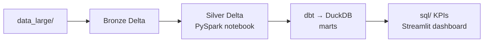

# Documentation hub

Welcome. This folder is the **learning and operations center** for the Pakistani social protection / humanitarian data engineering portfolio. Use it to understand **why** the pipeline exists, **how** to run it safely on your machine, and **where** to explore results (notebooks, dbt docs, Streamlit).

---

## Start here (onboarding story)

You are walking through a **miniature lakehouse**: files in mixed formats land in **Bronze** (Delta, raw-ish), a PySpark notebook promotes them to **Silver** (cleaner, deduplicated), **dbt** builds **Gold** marts inside **DuckDB**, and **SQL + dashboards** read those marts for KPIs.

**Suggested first hour**

1. Read [CONCEPTS_AND_PURPOSE.md](CONCEPTS_AND_PURPOSE.md) (15–20 minutes) for the mental model and vocabulary.
2. Skim [SCOPE_AND_CLOUD.md](SCOPE_AND_CLOUD.md) for **what is in/out of scope** and **cloud alternatives** to the local stack.
3. Open [getting-started.html](getting-started.html) in a browser and copy commands for your shell (`start docs\getting-started.html` on Windows from repo root).
4. Follow [LEARNING_GUIDE.md](LEARNING_GUIDE.md) **Section 5** for a full setup with explanations (venv, Java, Windows Spark quirks, `DELTA_LAKE_PATH`).
5. Run the pipeline once (Windows: `.\scripts\run-full-pipeline.ps1`; Unix: `make all` after exporting `DELTA_LAKE_PATH`).
6. Open the **Streamlit dashboard** ([JUPYTER_AND_NOTEBOOKS.md](JUPYTER_AND_NOTEBOOKS.md#streamlit-dashboard-story-led-kpis) or `.\scripts\run-dashboard.ps1`) or explore the **onboarding notebook** `notebooks/00_onboarding_tour.ipynb`.

---

## Document map

| Document | Audience | What you get |
|----------|----------|----------------|
| [training/README.md](training/README.md) | **Trainers** | Program: [COMPLETE_TECHNICAL_TRAINER_GUIDE.md](training/COMPLETE_TECHNICAL_TRAINER_GUIDE.md); marketing: [COURSE_MARKETING.md](training/COURSE_MARKETING.md); slides: [TRAINER_SLIDES_WITH_SPEAKER_NOTES.md](training/TRAINER_SLIDES_WITH_SPEAKER_NOTES.md), [SLIDE_DECK_OUTLINE.md](training/SLIDE_DECK_OUTLINE.md) |
| [CONCEPTS_AND_PURPOSE.md](CONCEPTS_AND_PURPOSE.md) | Learners, interview prep | Medallion architecture, Delta vs DuckDB, dbt layers, domain context, local vs cloud mapping |
| [LEARNING_GUIDE.md](LEARNING_GUIDE.md) | Anyone running the repo | Canonical step-by-step setup, Windows/Java/Hadoop notes, stage-by-stage commands, troubleshooting |
| [SCOPE_AND_CLOUD.md](SCOPE_AND_CLOUD.md) | Everyone | **Scope** (in/out), **local vs cloud** mapping, `pspl` / `pspl.duckdb` naming |
| [RUN_EACH_COMPONENT.md](RUN_EACH_COMPONENT.md) | Operators, trainers | **Canonical per-component matrix:** Windows vs Unix commands, verify column, dependencies, Airflow install |
| [JUPYTER_AND_NOTEBOOKS.md](JUPYTER_AND_NOTEBOOKS.md) | Notebook users | JupyterLab vs nbconvert, kernels, `00_onboarding_tour` vs `delta_lake_operations`, dashboard entry |
| [getting-started.html](getting-started.html) | Quick copy/paste | Tabbed Bash vs PowerShell commands for install, pipeline, tests, clean |
| [data_dictionary.md](data_dictionary.md) | Analysts, modelers | Entities, grains, column meanings |
| [runbooks/ingestion_runbook.md](runbooks/ingestion_runbook.md) | Operators | Bronze ingest operations |
| [runbooks/dbt_runbook.md](runbooks/dbt_runbook.md) | Operators | dbt run/test/docs, `DELTA_LAKE_PATH` |
| [sample_outputs/](sample_outputs/) | Portfolio readers | Example KPI outputs and charts |

---

## Pipeline at a glance

**Order:** ingest → Silver notebook → `dbt run` / `dbt test` → KPI SQL or dashboard. Skipping a stage causes errors that look unrelated until you map them to this chain (see LEARNING_GUIDE Section 2).

---

## Related project files

- Root [README.md](../README.md) — repository overview and architecture diagram.
- [scripts/run-full-pipeline.ps1](../scripts/run-full-pipeline.ps1) — Windows orchestration.
- [Makefile](../Makefile) — Unix `make all` and targets.
- [dashboard/streamlit_app.py](../dashboard/streamlit_app.py) — interactive KPI visuals (requires `dbt run` first).

When something fails, run **one stage at a time** ([RUN_EACH_COMPONENT.md](RUN_EACH_COMPONENT.md) or LEARNING_GUIDE Section 9) and confirm artifacts on disk before moving on.
