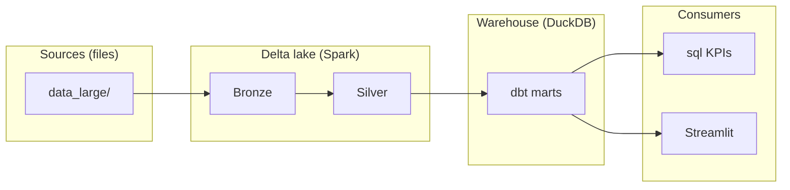

# Complete technical trainer guide — data engineering (this portfolio)

**Purpose:** End-to-end notes for **trainers** teaching this repo: **what** to say, **why** it matters, **which** files and commands prove each idea, and **how** to assess learners.  
**Companion:** [SLIDE_DECK_OUTLINE.md](SLIDE_DECK_OUTLINE.md) for slide-by-slide titles.  
**Learner runbook:** [../LEARNING_GUIDE.md](../LEARNING_GUIDE.md).

---

## Table of contents

1. [How to use this document](#1-how-to-use-this-document)
2. [Audiences, prerequisites, and constraints](#2-audiences-prerequisites-and-constraints)
3. [Measurable learning outcomes](#3-measurable-learning-outcomes)
4. [Timeboxed agendas](#4-timeboxed-agendas)
5. [Core concepts (teach & defend)](#5-core-concepts-teach--defend)
6. [Tooling & environment — technical detail](#6-tooling--environment--technical-detail)
7. [Ingestion — methods & repo mapping](#7-ingestion--methods--repo-mapping)
8. [PySpark, Delta Lake, Silver notebook](#8-pyspark-delta-lake-silver-notebook)
9. [dbt — methods & repo mapping](#9-dbt--methods--repo-mapping)
10. [Analytics SQL, DuckDB, Streamlit](#10-analytics-sql-duckdb-streamlit)
11. [Testing, quality, and documentation](#11-testing-quality-and-documentation)
12. [Orchestration, runbooks, and “production mindset”](#12-orchestration-runbooks-and-production-mindset)
13. [Mapping local stack → cloud (Databricks / ADF)](#13-mapping-local-stack--cloud-databricks--adf)
14. [Session-by-session lab script (trainer talk track)](#14-session-by-session-lab-script-trainer-talk-track)
15. [Assessments & rubrics](#15-assessments--rubrics)
16. [Classroom troubleshooting](#16-classroom-troubleshooting)
17. [Glossary (trainer quick reference)](#17-glossary-trainer-quick-reference)

---

## 1. How to use this document

- **Before the course:** Pick an agenda from [Section 4](#4-timeboxed-agendas), skim [Sections 5–13](#5-core-concepts-teach--defend), and rehearse demos from [Section 14](#14-session-by-session-lab-script-trainer-talk-track).
- **During labs:** Project the [LEARNING_GUIDE](../LEARNING_GUIDE.md) for Windows-specific fixes; keep the [data_dictionary](../data_dictionary.md) open for grain questions.
- **After each day:** Use formative checks in [Section 15](#15-assessments--rubrics); collect screenshots (dbt docs, Streamlit, query output).

---

## 2. Audiences, prerequisites, and constraints

### 2.1 Audience profiles

| Persona | Typical background | What they need most from this repo |
|--------|---------------------|-------------------------------------|
| **DE beginner** | SQL + light scripting | Vocabulary (Bronze/Silver/Gold), running stages in order, reading errors |
| **DE practitioner** | ETL/BI, new to Spark/dbt | PySpark boundaries, dbt DAG, Delta vs DuckDB split, tests |
| **Analytics engineer** | Strong SQL, light Python | dbt patterns, mart design, KPI SQL, Streamlit |
| **Tech lead / architect** | Systems design | Lakehouse trade-offs, cloud mapping, operability (runbooks, idempotency) |

### 2.2 Prerequisites (enforce before Day 1)

- **Python 3.10–3.11 (prefer 3.11)** — avoid 3.13+ for wheel stability with pinned stack.
- **JDK 11 or 17** with `JAVA_HOME` (trainers: demo `java -version` and echo `JAVA_HOME`).
- **Git** clone of the repo; **8 GB+ RAM**; **disk space** for Maven cache + Delta folders.
- **Windows only:** explain execution policy and `winutils` / `HADOOP_HOME` (see [LEARNING_GUIDE §6–7](../LEARNING_GUIDE.md)); recommend `scripts/run-full-pipeline.ps1` for parity.

### 2.3 Pedagogical constraint

Data are **synthetic**. Teach **patterns** (grain, lineage, tests), not humanitarian statistics as facts.

---

## 3. Measurable learning outcomes

By the end of a **3-day engineering track**, a learner should be able to:

1. **Explain** medallion layers and **order dependencies** (Bronze → Silver → dbt → consumers).
2. **Run** each pipeline stage independently and **verify artifacts** on disk (`delta_lake/*`, `pspl.duckdb`).
3. **Navigate** the dbt DAG (`sources.yml` → `stg_*` → `int_*` → `mart_*`) and **interpret** `dbt docs` lineage.
4. **Describe** why Spark writes Delta locally and why DuckDB + `delta_scan` reads Silver for Gold.
5. **Write or extend** a simple dbt model and a **singular test** or schema test (concept level).
6. **Locate** KPI logic in `sql/*.sql` and relate it to mart grain.
7. **Contrast** local tools with **Databricks + ADF + Unity Catalog** equivalents (interview-ready).

Adjust depth for shorter courses by dropping outcomes 5–7 or making them demo-only.

---

## 4. Timeboxed agendas

### 4.1 One day — “Lakehouse executive overview”

| Block | Duration | Focus |
|-------|----------|--------|
| A | 45m | Concepts: medallion, lake vs warehouse, why tests ([§5](#5-core-concepts-teach--defend)) |
| B | 45m | Live walk: repo map + README architecture diagram |
| C | 2h | **Trainer-driven** full pipeline on projector; learners follow if machines ready |
| D | 45m | dbt docs + one KPI SQL + Streamlit storyboard |
| E | 45m | Cloud mapping + Q&A ([§13](#13-mapping-local-stack--cloud-databricks--adf)) |

### 4.2 Two days — “Hands-on pipeline”

- **Day 1:** Environment ([§6](#6-tooling--environment--technical-detail)) + ingest + inspect Bronze + intro Spark/Delta ([§7–8](#7-ingestion--methods--repo-mapping)) + homework reading `CONCEPTS_AND_PURPOSE`.
- **Day 2:** Silver notebook + dbt run/test/docs + KPIs + Streamlit + assessment ([§9–11](#9-dbt--methods--repo-mapping)).

### 4.3 Three days — “Engineering depth” (recommended)

- **Day 1:** Environment + concepts + **ingest code walk** (`readers.py`, `ingest.py`) + single-dataset ingest + pytest subset.
- **Day 2:** **Silver notebook** cell-by-cell themes (dedupe, windows, time travel) + `DELTA_LAKE_PATH` + dbt staging/intermediate.
- **Day 3:** Marts + KPI SQL + **extend dbt** (exercise) + cloud mapping + **15.2 summative lab**.

### 4.4 Five days — “Bootcamp + capstone”

Add: property-based testing deep dive, failure injection (delete Silver path → observe dbt error), **capstone** design a new mart column + test + doc paragraph.

---

## 5. Core concepts (teach & defend)

### 5.1 Medallion architecture

- **Bronze:** minimal opinion; preserve upstream fidelity; good for **replay** and audits.
- **Silver:** **conformed entities** — types, keys, dedupe rules, null handling; team agreement layer.
- **Gold:** **subject areas / metrics** — business-friendly grains; fewer joins for analysts.

**Teaching tip:** Draw one entity (e.g. payments) from `data_large/` file → Bronze path → Silver path → `stg_payments` → `mart_payment_kpis`.

### 5.2 Idempotency & reruns

- Re-running ingest **overwrites** Bronze tables in this demo; discuss **merge semantics** in real systems.
- dbt models should be **rerunnable** without double-counting (learners: ask “what if this runs twice?”).

### 5.3 Grain (one row means…)

- Trainees must state grain before accepting a metric. Point to [data_dictionary](../data_dictionary.md) and `schema.yml` descriptions if present.

### 5.4 Lineage & contracts

- **Lineage:** `dbt docs` graph; `sources.yml` external locations.
- **Contracts:** dbt tests + documented columns; **Delta schema** evolution as a production topic.

### 5.5 Lakehouse (two-engine pattern in this repo)

- **Spark + Delta:** scalable **lake writes** and complex row ops in the notebook.
- **DuckDB + dbt:** fast **warehouse modeling** on a laptop; `delta_scan` bridges lake → SQL engine.

---

## 6. Tooling & environment — technical detail

| Tool | Role in repo | Teach these mechanics |
|------|----------------|------------------------|
| **Python `venv`** | Isolated deps | `python -m venv`, `py -3.11`, **never** rely on bare `pip` if it resolves to 3.14+ |
| **`setup.ps1`** | Windows bootstrap | `-Force` recreate; `--prefer-binary` rationale |
| **PowerShell execution policy** | Blocks `Activate.ps1` | `Set-ExecutionPolicy -Scope Process Bypass` or call `.venv\Scripts\python.exe` directly |
| **JDK / `JAVA_HOME`** | JVM for Spark | Spark driver runs on JVM even in local mode |
| **`HADOOP_HOME` + winutils`** | Windows file semantics | Script `run-full-pipeline.ps1` sets; mirror in tests |
| **`pip` / `requirements.txt`** | Pin reproducibility | Teach reading pins; when to upgrade (risk) |
| **Git** | Portfolio & collaboration | Branch per exercise; `.gitignore` for `delta_lake/`, duckdb |
| **Make vs PowerShell** | Orchestration parity | `Makefile` vs `scripts/*.ps1` — same DAG, different shells |

---

## 7. Ingestion — methods & repo mapping

### 7.1 Files & formats (multi-format ingestion)

| Format | Example file | Typical reader | Teaching point |
|--------|----------------|------------------|
| CSV.gz | `beneficiaries.csv.gz` | pandas / Spark | Compression + schema drift risk |
| Parquet | `payments.parquet` | pyarrow / Spark | Columnar + schema embedded |
| JSON | `surveys.json` | pandas / Spark | Nested documents vs flat tables |
| Avro | `inventory.avro` | fastavro → Spark | Schema evolution conversations |

**Repo:** `ingest/readers.py`, `ingest/transforms.py`, `ingest/ingest.py`.

### 7.2 CLI patterns

- Full ingest vs `--dataset` subset — reduces Spark time in class.
- **`DELTA_LAKE_PATH` not used here** — ingest writes relative `delta_lake/bronze`; dbt needs env var later.

### 7.3 Bronze Delta write

- Teach **append vs overwrite** behavior used in code (read `ingest.py` with class).
- Show `_delta_log` directory after run (physical proof of Delta).

### 7.4 Operational doc

- Assign skim: [../runbooks/ingestion_runbook.md](../runbooks/ingestion_runbook.md).

---

## 8. PySpark, Delta Lake, Silver notebook

### 8.1 PySpark essentials (concept layer)

- **Driver vs executor:** even `local[*]` uses threads/processes; still JVM.
- **Lazy evaluation:** transformations until an action (write, count).
- **Shuffle:** joins/groupBy cost; keep small demos filtered (`--dataset`).

### 8.2 Delta Lake essentials

- **Transaction log:** `_delta_log`; **time travel** (`VERSION AS OF`) if enabled in notebook — demo read.
- **Why Delta for Bronze/Silver:** ACID batch writes, evolution story closer to Databricks.

### 8.3 Silver notebook (`notebooks/delta_lake_operations.ipynb`)

Teach in this order:

1. SparkSession builder + Delta packages (parity with cluster configs).
2. Read Bronze path; show **schema**.
3. **Dedupe** pattern — why duplicates exist (ingest retries, upstream bugs).
4. **Window functions** — ranking, running totals (tie to KPI SQL later).
5. **Write Silver**; verify folder layout mirrors Bronze table names.

**Headless execution:** `jupyter nbconvert --execute` — link to CI / Workflow tasks.

---

## 9. dbt — methods & repo mapping

### 9.1 Project anatomy

- `dbt_project.yml` — model configs, materializations.
- `profiles.yml` — DuckDB path `../pspl.duckdb`, threads, `extensions: [delta]`.
- `models/sources.yml` — **`delta_scan('{{ env_var('DELTA_LAKE_PATH') }}/silver/...')`** — **parse-time env** requirement.

### 9.2 Layer patterns

| Layer | Prefix | Materialization (typical) | Teaching goal |
|-------|--------|---------------------------|----------------|
| Staging | `stg_` | view | 1:1 with source, rename + cast |
| Intermediate | `int_` | view | reusable joins/aggregates |
| Marts | `mart_` | table | KPI-ready grain |

### 9.3 dbt techniques to demonstrate

- `ref()` vs `source()` — **discipline** for lineage.
- **`dbt run --select model+`** — subgraph execution for debugging.
- **`dbt test`** — generic + singular tests in `tests/`.
- **`dbt docs generate && dbt docs serve`** — stakeholder + onboarding artifact.

### 9.4 Common classroom failure

- **`DELTA_LAKE_PATH` unset** — show the error string; fix with export or pipeline script.
- **Windows file lock** — brief sleep between Spark shutdown and dbt (script already waits); teach *why*.

---

## 10. Analytics SQL, DuckDB, Streamlit

### 10.1 Standalone KPI SQL (`sql/`)

- Each file is a **teachable SQL module**: CTEs, joins, **window functions** (`ROWS BETWEEN …`).
- Run via DuckDB CLI or `scripts/run-sql-kpis.ps1`.
- Compare outputs to `docs/sample_outputs/` for regression storytelling.

### 10.2 DuckDB specifics

- In-process OLAP; **attach nothing** — file path in `profiles.yml`.
- **delta extension** version note in project comments (trainer: read `profiles.yml` header).

### 10.3 Streamlit dashboard (`dashboard/streamlit_app.py`)

- Consumes **marts only** — reinforces Gold boundary.
- Use as **“analyst experience”** capstone: filters, multiple coordinated charts.

---

## 11. Testing, quality, and documentation

### 11.1 pytest + Hypothesis (`tests/`)

- **Unit tests** for pure Python transforms (`transforms.py`).
- **Spark tests** — environment heavy; optional track for advanced cohort.
- Teach **property-based** tests as invariant checks (e.g. monotonicity, bounds).

### 11.2 dbt tests

- **Schema tests** in YAML vs **singular** SQL tests — when each is appropriate.
- Relate tests to **contracts** for downstream dashboards.

### 11.3 Documentation set

- `docs/data_dictionary.md` — analyst contract.
- `docs/runbooks/*` — **day-2 ops** (on-call mindset).
- `notebooks/00_onboarding_tour.ipynb` — narrative onboarding.

---

## 12. Orchestration, runbooks, and “production mindset”

- **Makefile targets** — map each to an Airflow task / ADF activity / Databricks job.
- **Clean** — `make clean` / `clean-artifacts.ps1` — teach safe dev resets vs production retention policies.
- **Logging & observability** — contrast local printouts with cluster driver logs + metrics stores (concept).

---

## 13. Mapping local stack → cloud (Databricks / ADF)

Use the table in the root [README.md](../../README.md) as the slide anchor. Trainer narrative:

| Local | Cloud analogue | One-liner |
|-------|------------------|-----------|
| `ingest.py` | ADF-triggered Databricks job | Orchestrated batch land to Bronze |
| Delta folders in repo | ADLS + Delta tables | Path becomes `abfss://` |
| dbt-duckdb | dbt-databricks | Adapter + catalog swap |
| DuckDB SQL | Databricks SQL / warehouse | Semantic layer optional |
| Jupyter + Spark | Databricks notebooks | Cluster attach, job parameters |
| `make all` | Workflow / ADF pipeline | Idempotent stages + retry policies |

---

## 14. Session-by-session lab script (trainer talk track)

> Each block: **Say** (talk track) → **Show** (demo) → **Do** (learner task) → **Check** (verification).

### Session S0 — Setup (60–90m)

- **Say:** “We standardise on Python 3.11 and a venv so everyone compiles the same story.”
- **Show:** `py -3.11 -c "import sys; print(sys.version)"`; `.\setup.ps1 -Force -Python "py -3.11"` (Windows).
- **Do:** Learners recreate `.venv` and `pip list | findstr dbt` (or `pip show dbt-core`).
- **Check:** `dbt --version` inside venv.

### Session S1 — Repo map (45m)

- **Say:** “Artifacts, not slides, are the curriculum.”
- **Show:** Walk `data_large/` → `ingest/` → `delta_lake/` (after run) → `dbt/models` → `sql/`.
- **Do:** Learners draw their own diagram, then compare to README Mermaid.
- **Check:** Can name **order** of stages.

### Session S2 — Bronze ingest (90m)

- **Say:** “Bronze answers: what landed?”
- **Show:** `python ingest/ingest.py --dataset beneficiaries`; inspect `delta_lake/bronze/beneficiaries/_delta_log`.
- **Do:** Ingest one more dataset; open `readers.py` and trace a function.
- **Check:** Bronze folder exists; can explain **which reader** for Avro vs Parquet.

### Session S3 — Silver notebook themes (2h)

- **Say:** “Silver is where engineering disagreements should surface.”
- **Show:** Run two cells: read Bronze + dedupe + write Silver (do not rush full notebook if timeboxed).
- **Do:** Learners modify a filter (safe exercise) or compute a new column in a **copy** branch.
- **Check:** Silver path updated; can articulate **grain** of one Silver table.

### Session S4 — dbt Gold (2h)

- **Say:** “dbt is versioned analytics engineering.”
- **Show:** `export DELTA_LAKE_PATH=.../delta_lake` (Unix) or pipeline script on Windows; `dbt run --select stg_beneficiaries+`.
- **Do:** `dbt test` on a small selection; open `dbt docs`.
- **Check:** `pspl.duckdb` exists; lineage visible.

### Session S5 — KPIs & dashboard (90m)

- **Say:** “Marts are not the report — they enable many reports.”
- **Show:** Run one `sql/*.sql`; open Streamlit.
- **Do:** Learners pick a KPI and explain **business question** + **grain** in one paragraph.
- **Check:** Written explanation peer-reviewed.

### Session S6 — Testing & cloud mapping (60–90m)

- **Say:** “Tests buy the right to refactor.”
- **Show:** `pytest tests/test_transformations.py -q` (subset); map stack to Databricks slide.
- **Do:** Learners write a one-sentence **definition of done** for a new dbt model.

---

## 15. Assessments & rubrics

### 15.1 Formative (daily)

- **Exit ticket:** “What breaks if Silver is missing?” (expect: dbt `delta_scan` / missing path).
- **Pair debug:** intentional `DELTA_LAKE_PATH` typo — fix in 5 minutes.

### 15.2 Summative lab (120m) — suggested

**Task:** Add a documented **dbt schema test** (e.g. `mart_payment_kpis.success_rate` between 0 and 1) **or** a new column in a staging model with test + one paragraph in YAML `description`.

| Criterion | Poor (0) | Acceptable (1) | Strong (2) |
|-----------|----------|----------------|------------|
| Correctness | Fails `dbt parse/run` | Runs with minor warnings | Clean `dbt test` |
| Grain awareness | Cannot state grain | Grain stated, mostly accurate | Grain + joins defended |
| Lineage hygiene | Uses hard-coded paths | Uses `ref`/`source` mostly | Idiomatic dbt patterns |
| Communication | Missing description | Minimal doc | Clear stakeholder wording |

### 15.3 Portfolio defence (mock interview)

Three questions:

1. “Walk me from a raw file to a KPI on a dashboard.”
2. “Where would you test: Python vs dbt vs integration?”
3. “How would you migrate this to Databricks?”

---

## 16. Classroom troubleshooting

| Symptom | Root cause | Fix |
|---------|------------|-----|
| Pandas builds from source / Meson | Wrong Python (3.14) | `setup.ps1 -Python "py -3.11"` |
| `Activate.ps1` blocked | Execution policy | Process-scope Bypass or direct `python.exe` |
| Spark `HADOOP_HOME` / `winutils` | Windows Hadoop shim | Use `run-full-pipeline.ps1` pattern |
| `DELTA_LAKE_PATH` missing | dbt parse env | Forward slashes; set in shell |
| dbt cannot open Delta | Spark still holding file | Wait / close JVM / rerun order |
| Streamlit email prompt / exit | Non-interactive stdin | Use updated `run-dashboard.ps1` |

Full table: [../LEARNING_GUIDE.md §9](../LEARNING_GUIDE.md).

---

## 17. Glossary (trainer quick reference)

- **Action (Spark):** triggers computation (e.g. `count`, `write`).
- **DAG:** directed acyclic graph of models or pipeline tasks.
- **Grain:** what a single row represents.
- **`delta_scan`:** DuckDB function to read Delta tables from paths.
- **Idempotent:** repeated run does not corrupt state (ideal goal).
- **Lineage:** upstream/downstream dependencies between datasets/models.
- **Mart:** business-ready fact/dimension-style table in dbt.
- **Materialization:** how dbt persists a model (view/table/incremental).
- **Medallion:** Bronze / Silver / Gold layering pattern.
- **Staging model:** `stg_*` adapter from raw/silver sources.
- **Transformation (Spark lazy):** not executed until an action.

---

## Appendix A — Mermaid slide (copy to deck)

---

## Appendix B — Trainer checklist (printable)

- [ ] Verify cohort Python + Java versions  
- [ ] Run full pipeline once on trainer machine the morning of  
- [ ] Pre-download Maven deps if classroom network is weak (run Spark once online)  
- [ ] Mirror `DELTA_LAKE_PATH` fix on slide  
- [ ] Backup plan: demo-only on projector if learner GPUs/RAM insufficient  
- [ ] Collect `dbt docs` + Streamlit screenshots for rubric examples  

---

*End of trainer master guide. Slides: [SLIDE_DECK_OUTLINE.md](SLIDE_DECK_OUTLINE.md). Hub: [README.md](README.md).*
