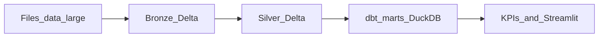

# Course marketing pack — 10‑Day Local Lakehouse Camp

**Use this file for:** landing pages, cohort announcements, LinkedIn/Meetup posts, sponsor one‑pagers, and trainer briefing.  
**Technical depth:** [COMPLETE_TECHNICAL_TRAINER_GUIDE.md](COMPLETE_TECHNICAL_TRAINER_GUIDE.md) · **Slides + speaker notes:** [TRAINER_SLIDES_WITH_SPEAKER_NOTES.md](TRAINER_SLIDES_WITH_SPEAKER_NOTES.md)

---

## Positioning (single paragraph)

This cohort is a **10‑day, fully local data engineering camp** on your own PC. You run a **lakehouse‑shaped** pipeline end to end—multi‑format files → **Bronze Delta** (PySpark) → **Silver Delta** (notebook) → **dbt marts in DuckDB** (Gold) → **KPI SQL + Streamlit**—using the same **patterns and vocabulary** you would use with **Azure Data Factory, ADLS, Databricks Delta, and dbt in production**. Data are **synthetic** (Pakistani social protection–style scenario); you learn **grain, lineage, tests, and reruns**, not official statistics.

---

## Title and subtitle variants

| # | Title | Subtitle / tagline |
|---|--------|-------------------|
| **A (recommended)** | **10‑Day Local Lakehouse Camp** | Build a **cloud‑shaped** pipeline on your PC — Delta, dbt, DuckDB, ready to map to Databricks + ADF |
| B | **10‑Day Data Engineering Camp — Laptop Edition** | **Local first.** Production‑ready concepts. No cloud bill required to learn the stack. |
| C | **From Files to Dashboards in 10 Days** | Medallion architecture, **PySpark + Delta**, **dbt**, **DuckDB** — the same story enterprises tell, runnable offline after setup |
| D | **Lakehouse Patterns Bootcamp (10 Days)** | Synthetic humanitarian/social‑protection **practice domain**; real engineering habits: contracts, tests, runbooks |
| E | **DE on Your Machine: 10‑Day Intensive** | **Bronze → Silver → Gold** with a clear **local → cloud** migration narrative for interviews and design reviews |

**Short taglines (one line each):**

- *Train where you compile — ship what the cloud expects.*
* *Medallion on disk. Marts in DuckDB. Story in your portfolio.*
* *Same DAG as production — smaller hardware, zero guesswork.*

---

## Elevator pitch (30 seconds)

Most data engineering courses either skim the lake or drown you in cloud bills. In this camp you **install once**, work **entirely on your machine**, and still practice the **full arc**: ingest heterogeneous files, land **ACID Delta** tables, clean and conform in **Spark**, model **Gold** with **dbt**, validate with **tests**, and serve **KPIs** through **SQL and Streamlit**. When you interview or design for **Databricks**, you already know **what changes** (adapters, paths, orchestration) — because you built the **shape** locally first.

---

## Why local first?

- **Predictable cost:** No per‑cluster or per‑TB surprise; focus on learning loops.
- **Reproducible environment:** Python **3.11**, pinned `requirements.txt`, `venv` — same story as serious teams use for pins and CI.
- **Real binaries:** You touch **`_delta_log`**, Delta folders, DuckDB file, and dbt artifacts — not a black‑box sandbox.
- **Offline‑capable practice:** After initial dependency pulls (e.g. Spark/JAR resolution), much of the work is repeatable without continuous cloud access.
- **Debugging muscle:** File locks, `DELTA_LAKE_PATH`, Windows vs Unix paths — the same *classes* of problems appear in production, with faster iteration locally.

## Why “cloud ready”?

The repository is explicitly structured as a **local mirror** of a common enterprise path:

| You build locally | Maps to (conceptually) |
|-------------------|-------------------------|
| `ingest/ingest.py` | ADF‑triggered or scheduled **ingestion jobs** |
| Delta under `delta_lake/` | **ADLS Gen2** + **Delta tables** |
| `notebooks/delta_lake_operations.ipynb` | **Databricks** notebooks / jobs |
| dbt + DuckDB + `delta_scan` | **dbt‑Databricks** + **Unity Catalog** / warehouse SQL |
| `sql/*.sql`, Streamlit | **Databricks SQL**, BI tools reading curated marts |
| `make all` / `scripts/run-full-pipeline.ps1` | **Workflows**, **ADF pipelines**, job dependencies |

You leave with a **sentence‑level migration story** and a repo you can **demo from disk**.

---

## Who this is for / not for

### Ideal learners

- **Career switchers** with SQL + basic scripting who want a **credible portfolio arc** (lakehouse vocabulary + runnable repo).
- **Analysts / BI developers** growing into **analytics engineering** or **DE** (dbt, tests, grain).
- **Developers** new to **Spark/Delta** who learn best by **running writes** and inspecting logs and folders.
- **Tech leads** who need a **shared mental model** for medallion layers, test boundaries, and **local vs cloud** trade‑offs.

### Not the best fit

- Anyone needing **official government or NGO statistics** as course facts (data are **synthetic**).
- Teams that require **only** cloud IDE training with zero local install (this camp is **PC‑centric** by design).
- Pure **ML / feature store** depth — this camp is **batch lakehouse + dbt + analytics consumption**.

Personas aligned with the trainer guide: see [COMPLETE_TECHNICAL_TRAINER_GUIDE.md §2.1](COMPLETE_TECHNICAL_TRAINER_GUIDE.md#21-audience-profiles).

---

## Prerequisites and machine spec

- **Python 3.10–3.11 (prefer 3.11)** — avoid bleeding‑edge Python for wheel stability with the pinned stack.
- **JDK 11 or 17** with `JAVA_HOME` set.
- **Git**, **8 GB+ RAM**, free disk for Maven cache + Delta output folders.
- **Windows 10/11, macOS, or Linux** — Windows learners use PowerShell scripts and notes in [LEARNING_GUIDE.md](../LEARNING_GUIDE.md) (`HADOOP_HOME`, execution policy, `DELTA_LAKE_PATH` forward slashes).
- **Network** during initial setup for first Spark/Maven pulls (classrooms with weak Wi‑Fi: trainers pre‑warm one full run).

---

## Measurable outcomes (cohort level)

By the end of Day 10, learners should be able to:

1. Explain **Bronze / Silver / Gold** and **order of execution** across ingest, notebook, dbt, and dashboard.
2. Run each **stage** independently and **verify artifacts** (`delta_lake/*`, `pspl.duckdb`, tests, docs).
3. Navigate the **dbt DAG** and read **`dbt docs`** lineage as a communication artifact.
4. State **grain** for a mart and tie it to [data_dictionary.md](../../data_dictionary.md) / model descriptions.
5. Contrast **where to test** (Python vs dbt vs integration) and justify one **new or extended test**.
6. Produce a **one‑page “local → Databricks/ADF”** mapping for this repo (interview‑ready).

Detailed rubrics: [COMPLETE_TECHNICAL_TRAINER_GUIDE.md §15](COMPLETE_TECHNICAL_TRAINER_GUIDE.md#15-assessments--rubrics).

---

## 10‑day syllabus (suggested)

Each day assumes **3–5 hours** focused instruction + lab (adjust for your timezone and breaks). **Slide ranges** refer to [TRAINER_SLIDES_WITH_SPEAKER_NOTES.md](TRAINER_SLIDES_WITH_SPEAKER_NOTES.md) for lecture/recap blocks; deep labs follow [COMPLETE_TECHNICAL_TRAINER_GUIDE.md §14](COMPLETE_TECHNICAL_TRAINER_GUIDE.md#14-session-by-session-lab-script-trainer-talk-track).

| Day | Theme | Learning objectives | Key repo / commands | Homework |
|-----|--------|----------------------|---------------------|----------|
| **1** | Kickoff + environment | Mental model of lakehouse; venv + Java; repo map | `docs/CONCEPTS_AND_PURPOSE.md`, `setup.ps1`, `README.md` diagram | Read concepts doc; list pipeline stages in order |
| **2** | Medallion + tools I | Bronze/Silver/Gold definitions; Python/Spark/Delta vocabulary | Slides 7–13; `requirements.txt` | Skim `ingest/readers.py` — one format trace |
| **3** | Ingestion + Bronze | Land files to Delta; inspect `_delta_log` | `python ingest/ingest.py --dataset beneficiaries`, `delta_lake/bronze/` | Ingest second dataset; note reader choice |
| **4** | Silver notebook I | Dedupe, schema, write Silver; lazy vs action | `notebooks/delta_lake_operations.ipynb` | Short write‑up: why duplicates exist |
| **5** | Silver notebook II | Windows, grain, optional time travel / windows | Same notebook; [LEARNING_GUIDE.md](../LEARNING_GUIDE.md) § Windows | One “grain sentence” for a Silver table |
| **6** | dbt I — bridge to Gold | `DELTA_LAKE_PATH`, sources, `stg_*` | `dbt/models/sources.yml`, `stg_*` | Fix intentional path typo exercise (trainer) |
| **7** | dbt II — DAG + marts | `int_*`, `mart_*`, materializations | `dbt run --select`, `dbt test` | `dbt docs generate` + screenshot lineage |
| **8** | KPIs + Streamlit + SQL | Marts as single source for analytics | `sql/`, `dashboard/streamlit_app.py` | One KPI: business question + grain paragraph |
| **9** | Quality + ops | pytest/Hypothesis subset; runbooks; clean/retry | `tests/`, `docs/runbooks/`, `make clean` / `scripts/clean-artifacts.ps1` | Read one runbook; write “definition of done” for a model |
| **10** | Cloud mapping + capstone + defence | Local → ADF/Databricks; summative lab; mock interview | Guide §13, §15.2–15.3 | Capstone: test **or** documented column + YAML description |

**Buffer:** If your cohort needs slower pacing, split Day 5 across two calendar days (Silver + Windows troubleshooting) and Day 7 (dbt staging vs full DAG).

---

## Deliverables learners keep

- A **green** local run of the full DAG (or documented staged runs).
- **`dbt docs`** export or screenshots showing **lineage**.
- **Streamlit** walkthrough recording or screenshots tied to **mart grain**.
- **Summative artifact:** schema test or singular test, or new column + `description` + passing `dbt test`.
- **Migration one‑pager:** table from marketing “Why cloud ready” section, filled in with *this repo’s* paths and job names.

---

## Objection handling (FAQ)

| Objection | Response |
|-----------|----------|
| *“I don’t want to install Java.”* | PySpark’s driver is JVM‑based; this is the **same dependency class** as Databricks driver workloads. We standardise versions and scripts to reduce pain. |
| *“Why synthetic / fake data?”* | **Safety and speed** — we teach **contracts and grain** without PII incidents. Numbers are not official statistics. |
| *“Windows is broken for Spark.”* | The repo ships **PowerShell** patterns (`run-full-pipeline.ps1`, `HADOOP_HOME`, execution policy). Trainers use [LEARNING_GUIDE.md](../LEARNING_GUIDE.md) live. |
| *“Why DuckDB if the cloud is Spark?”* | **dbt patterns** (sources, refs, tests, docs) transfer directly; `delta_scan` is the **bridge** from lake files to SQL. Production often still separates **lake compute** from **warehouse SQL**. |
| *“Will I learn the cloud UI?”* | This camp optimises for **architecture and code** you can run free locally. Day 10 connects **concepts** to Databricks/ADF; optional add‑on is a guided cloud lab with your own subscription. |
| *“Is 10 days too long?”* | Ten days spreads **setup, failure modes, and capstone** without rushing Silver+dbt into a single weekend. Organisations can compress to **5 days** using [COMPLETE_TECHNICAL_TRAINER_GUIDE.md §4.4](COMPLETE_TECHNICAL_TRAINER_GUIDE.md#44-five-days--bootcamp--capstone) plus homework. |

---

## Email / announcement templates

### Short (≤150 words)

**Subject:** 10‑Day Local Lakehouse Camp — data engineering on your PC  

We’re running a **10‑day hands‑on camp** where you build a full **Bronze → Silver → Gold** pipeline **locally**: PySpark and **Delta Lake**, **dbt**, **DuckDB**, KPI **SQL**, and a **Streamlit** dashboard. The scenario is **synthetic social‑protection–style** data — you learn **real engineering patterns** (grain, tests, lineage, reruns) without a cloud bill.  

**You’ll need:** Python **3.11**, **JDK 11/17**, **Git**, **8 GB+ RAM**, and willingness to troubleshoot Windows/macOS/Linux paths with our runbook.  

**Outcome:** runnable portfolio + **cloud migration narrative** (Databricks / ADF shaped).  

Details: [COURSE_MARKETING.md](COURSE_MARKETING.md) · Setup: [LEARNING_GUIDE.md](../LEARNING_GUIDE.md)

### Long (trainer‑editable)

**Subject:** [Cohort name] — 10‑Day Local Lakehouse Data Engineering Camp  

Hi [Name / cohort],  

Over **10 sessions**, you will take **heterogeneous files** (CSV.gz, Parquet, JSON, Avro) through **Bronze Delta** tables, promote them to **Silver** using a **PySpark notebook**, then model **Gold marts** with **dbt** into **DuckDB**, and finally consume those marts through **`sql/` recipes** and a **Streamlit** dashboard. Everything runs **on your machine** with pinned dependencies and scripts so we spend time on **design and quality**, not on guessing versions.  

**Why this matters:** Enterprise lakehouses often combine **orchestrated ingestion**, **Delta** storage, **Spark** transforms, **dbt** governance, and **SQL consumers**. This repo mirrors that **shape** using open‑source tools so you can **practice, break, and fix** safely. On the final day we explicitly map each stage to **Azure Data Factory**, **ADLS**, and **Databricks** concepts so you can explain migrations in interviews and architecture reviews.  

**Important:** All **numbers are fictional**; we teach **patterns**, not official statistics.  

**Before Day 1:** install prerequisites per [LEARNING_GUIDE.md](../LEARNING_GUIDE.md) Section 5 and confirm `java -version` and `python --version`.  

**Trainers:** technical program [COMPLETE_TECHNICAL_TRAINER_GUIDE.md](COMPLETE_TECHNICAL_TRAINER_GUIDE.md); slides [TRAINER_SLIDES_WITH_SPEAKER_NOTES.md](TRAINER_SLIDES_WITH_SPEAKER_NOTES.md).  

See you in the first session,  
[Signature]

---

## Optional commercial placeholders

| Field | Value |
|-------|--------|
| Price | `[TBD]` |
| Cohort size cap | `[TBD]` |
| Live vs async | `[TBD]` |
| Office hours | `[TBD]` |
| Certificate / badge | `[TBD]` |

---

## Mermaid diagram (for landing page or deck)

---

## Related documents

| Document | Role |
|----------|------|
| [COMPLETE_TECHNICAL_TRAINER_GUIDE.md](COMPLETE_TECHNICAL_TRAINER_GUIDE.md) | Agendas, labs, troubleshooting, assessments |
| [TRAINER_SLIDES_WITH_SPEAKER_NOTES.md](TRAINER_SLIDES_WITH_SPEAKER_NOTES.md) | Slide manuscript with speaker notes |
| [SLIDE_DECK_OUTLINE.md](SLIDE_DECK_OUTLINE.md) | Compact slide titles + bullets only |
| [../LEARNING_GUIDE.md](../LEARNING_GUIDE.md) | Learner setup and run commands |
| [../CONCEPTS_AND_PURPOSE.md](../CONCEPTS_AND_PURPOSE.md) | Concepts and local vs cloud narrative |

---

*Marketing pack end.*
